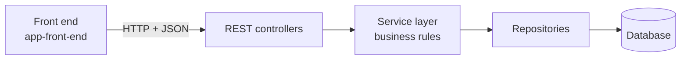
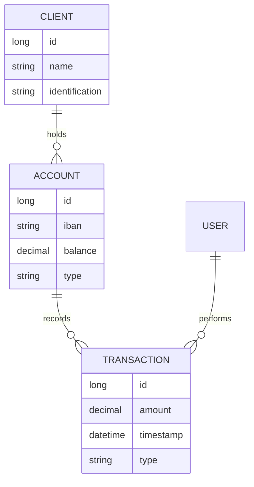

<div align="center">

# JBank

**A banking application — Java service layer behind a separate front end.**

Technical University of Cluj-Napoca


</div>

---

Banking is the standard teaching domain for a reason. The rules are simple enough to state in a sentence and strict enough that being almost right is the same as being wrong. Money does not tolerate a rounding error, a lost update, or a half-finished transfer.

<br>

## Architecture



The split between the two folders is the point of the design. The front end knows nothing about how balances are stored; the back end knows nothing about how they are displayed. Each side can be replaced without touching the other, and the API contract is the only thing they agree on.

The service layer is where the rules live — not the controllers, and not the repositories. A controller that computes interest is a controller you cannot test without starting a web server.

<br>

## Domain model



A transaction row is never edited or deleted. A reversal is a new row in the opposite direction. That is what makes the ledger auditable — you can replay every row from the beginning and arrive at the current balance, which is impossible if history can be rewritten.

<br>

## Transfers and atomicity


A transfer is two writes: one account decreases, another increases. Run them as separate operations and there is a window between them where the money exists nowhere. A crash, an exception, or a failed constraint in that window destroys value.

Wrapping the pair in a single transaction closes the window. Either both writes commit or neither does. In Spring this is one annotation on the service method:

```java
@Transactional
public void transfer(Long fromId, Long toId, BigDecimal amount) {
    // debit and credit — both, or neither
}
```

Two things about that annotation that are easy to get wrong:

It only applies when the method is called **from outside the class**. Spring implements it with a proxy, so a private method or a call from another method in the same bean bypasses it entirely and silently.

It rolls back on unchecked exceptions by default. A checked exception commits unless you say `@Transactional(rollbackFor = ...)`.

<br>

## Money is not a double

```java
double  a = 0.1 + 0.2;   // 0.30000000000000004
```

Binary floating point cannot represent 0.1 exactly, and the error compounds across every operation. After a few thousand transactions the ledger no longer balances, and nothing in the code looks wrong.

`BigDecimal` stores the value and the scale separately, so 0.10 is exactly 0.10. It costs more memory and more CPU, and it is not optional for currency.

| | |
|---|---|
| Storage | `BigDecimal` in Java, `DECIMAL(19,2)` or `NUMERIC` in the database — never `FLOAT` |
| Comparison | `compareTo() == 0`, never `equals()` — `equals` treats 1.0 and 1.00 as different |
| Rounding | Always specify a `RoundingMode`; the default throws on inexact division |

<br>

## Concurrency on a balance

Two withdrawals arriving at the same moment both read a balance of 100, both check that 80 is available, both write 20. The account has paid out 160 it did not have.

This is the lost-update problem with real consequences, and the application-level check does not prevent it — both requests passed the check before either wrote.

| Approach | How it works | When to use it |
|---|---|---|
| Optimistic locking | A `@Version` column; the second write fails and retries | Conflicts are rare, which is the normal case |
| Pessimistic locking | `SELECT ... FOR UPDATE` holds a row lock | Conflicts are frequent and retrying is expensive |
| Database constraint | `CHECK (balance >= 0)` | Always — the last line of defence |

The constraint belongs there regardless of which locking strategy you choose. Application code can be bypassed by a migration script, a second service, or a developer with a database client. The constraint cannot.

<br>

## Running it

```bash
# Back end
cd app-back-end/bankapplicaiton
mvn spring-boot:run

# Front end
cd app-front-end
npm install && npm start
```

<br>

## Repository

```
JBank-Repository/
├── docs/                              diagram used by this README
├── app-back-end/
│   └── bankapplicaiton/               Java service and REST API
└── app-front-end/                     client application
```

<br>

## What needs correcting

GitHub blocks automated access to repository subdirectories, so I worked from the two folder names. Three things to verify before you publish this:

| Assumption | If wrong |
|---|---|
| Spring Boot + Maven on the back end | Badge and the `mvn spring-boot:run` command change |
| An npm-based front end | The front-end command changes; if it is Java Swing or JSP, the architecture diagram changes too |
| The domain model above | Client, Account, Transaction and User are the conventional entities. Replace the ER diagram with your actual one. |

The sections on atomicity, `BigDecimal` and concurrency describe what a correct banking application has to handle. If the code does not currently do these things, they read better as a **Known limitations** section than as a description — a reviewer who opens the service layer and finds `double` will trust nothing else on the page.

One more thing worth fixing while you are in there: the folder is spelled `bankapplicaiton`. Renaming it is a one-line commit now and an annoyance later.
